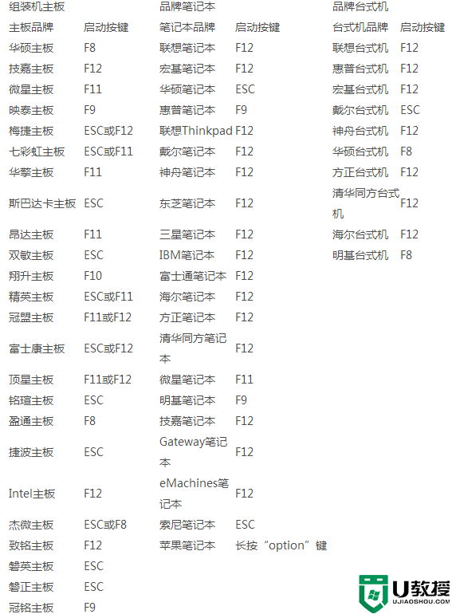

# Hello Word

Hello World 这个笔记主要及一些计算机相关知识，以及学习编程用的的工具、插件、包之类的。

## 计算机：


## windows电脑快捷键：

```scss
ctrl + shift + t   // 恢复上一个关闭的标签页
```
## CMD 命令：

 **win + r 输入cmd**

#### Shell 终端命令：
``` shell

dir 										# 查看计算机文件目录  /s 包括子目录 又称遍历目录
Start-Process Powershell -Verb RunAs		# 以管理员身份运行 Power Shell
netstat -ano							 	# 查看端口号
netstat -ano|findstr '端口号'				  # 查看指定端口号

ping 192.168.1.1   # 测试路由器
ping 127.0.0.1     # 测试网卡
ping www.baidu.com # 测试Internet

cd\ 切换c盘

# 查看已经连过的WiFi名
netsh
wlan show profiles 

# 查看选择WiFi名 的详细信息
wlan show profiles name="WiFi名" key=clear  

# 查看电脑活动连接
netstat

cd 目录名/目录           	# 进入目录
cd ..                   	# 返回上一级目录
rename 原文件名 新文件名 	  # 重命名
dir                     	# 查看文件目录
E:                      	# 直接进入E盘
cls                     	# 清空命令
doskey /histry          	# 查看历史命令
color a                 	# 更改命令 字体背景颜色
md 目录名称             	 # 创建目录 全拼 mkdir 
del 文件名               	# 删除文件


regedit  				# 注册表
calc      				# 计算器
cliconfg  				# SQL SERVER 客户端网络实用程序
nodepad   				# 打开记事本
mstsc     				# 远程桌面连接
ctrl + c 				# 结束进程

```
## 计算机系统存储：

 计算机存储单位一般用 bit(位)、B(字节byte)、KB、MB、GB、TB、PB、EB、ZB、YB、BB、NB、DB......以此从小到大来表示，它们之间的关系是：1024


## 转义字符：

**\ 转义字符**

| 转义字符 | 意义                                | ASCII码值（十进制） |
| -------- | ----------------------------------- | ------------------- |
| \a       | 响铃(BEL)                           | 007                 |
| \b       | 退格(BS) ，将当前位置移到前一列     | 008                 |
| \f       | 换页(FF)，将当前位置移到下页开头    | 012                 |
| \n       | 换行(LF) ，将当前位置移到下一行开头 | 010                 |
| \r       | 回车(CR) ，将当前位置移到本行开头   | 013                 |
| \t       | 水平制表(HT) （跳到下一个TAB位置）  | 009                 |
| \v       | 垂直制表(VT)                        | 011                 |
| \\       | 代表一个反斜线字符''\'              | 092                 |
| \'       | 代表一个单引号（撇号）字符          | 039                 |
| \"       | 代表一个双引号字符                  | 034                 |
| \?       | 代表一个问号                        | 063                 |
| \0       | 空字符(NUL)                         | 000                 |
| \ddd     | 1到3位八进制数所代表的任意字符      | 三位八进制          |
| \xhh     | 十六进制所代表的任意字符            | 十六进制            |


## Nvm：

nvm全名node.js version management，是一个node的版本管理工具。

首先最重要的是：一定要卸载已安装的 NodeJS，否则会发生冲突。然后下载 nvm-windows 最新安装包，直接安装即

可。

去GitHub上下载 [https://github.com/coreybutler/nvm‐windows/releases ](https://github.com/coreybutler/nvm‐windows/releases)

下载 nvm‐setup.zip


***Nvm 常用命令：***

```shell
#查看nvm版本
nvm version

#下载15.13.0版本的node
nvm install v15.13.0 

#卸载15.13.0版本的node
nvm uninstall v15.13.0

#查看已下载的node
nvm list 

#查看当前使用node的版本
nvm current 

#使用最新版本的node
nvm use 15.13.0  

#查看网络可以安装的版本
nvm list available 

#打开node版本控制
nvm on 

#关闭node版本控制
nvm off 
```

## BIOS：

bios芯片 是电脑主板上一个独立芯片，用来诊断电脑


各种品牌电脑进入bios的按键：




## Github 使用技巧：


在网页版编辑器总打开项目： 在浏览器地址栏 前缀输入 gitpod.io/#/

在CodeEsandBox中打开项目：  在GitHub域名后加box。例如：githubbox.com

### 快捷键：

```scss
ctrl + k             // 打开命令面板
T					 // 快速进入某个目录文件  快速检索
。                   // 在网页使用 VsCode 打开项目
S                    // 聚焦到搜索引擎
T                    // 对仓库内的项目路径搜索
L                    // 跳转到某一行
B                    // 查看该文件改动记录
```

### 高级搜索命令：

in:name xxx (项目名称中含有“xxx”)

in:readme xxx (readme中含有“xxx”)
in:description xxx (描述中有“xxx”)
stars:>1000 star>1000 (星星数大于1000的）
forks:>1000 fork>1000 （forks数大于1000的）
pushed:>2019-09-01 （2019年9月1日后有更新，代表着项目的活跃程度）
language:java （用Java语言编写的项目）


## 


## 学习Git：


- workspace：工作区
- staging area：暂存区/缓存区
- local repository：版本库或本地仓库
- remote repository：远程仓库

### 使用Git：


 git init 初始化git生成git仓库

 git status 查看git状态

 git add filename 添文件到暂存区

 git add . 加入所有文件到暂存区

 git commite -m message 提交文件到本地仓库

 git reset filename  将尚没有commite之前加入到暂存区的文件重新拉回

### 文件状态：

 1.没有被add过的文件叫untracked

 2.add之后文件处于staged状态等待commite

 3.commit之后文件处于unmodified这里之所以是modified是因为

 文件会跟仓库中的文件对比

 4.当unmodified的文件被修改则会变为modified状态

 5.modified之后的文件add之后将继续变为staged状态

 6.unmodifed的文件还有一种可能是已经不再需要了，那么可以

 remove它不再追踪变为untracked状态

``` shell
git config -l													   #查看配置
git config --system --list										   #查看本地配置
git config --global user.name "大头康"       	                     #设置用户名 
git config --global user.email "Kangbro@126.com"                   #设置邮箱 
git config --global --list										   #查看全局配置
git init  		                 	                               #初始化仓库 
git remote show origin											   #查看 origin 信息
git remote add 远程主机名称 远程仓库地址							 #设置远程仓库地址 origin 仓库名称
git remote set-url 远程主机名 远程仓库地址							  #修改远程仓库地址
git remote rename 旧远程主机名 新远程主机名							 #修改仓库名称
git add .		                                                   #选择要上传的内容  . 代表全部 添加到暂缓区
git commit -m 'message' 	                                       #将暂缓区内容添加到仓库中  描述主要修改类型和内容

git push --set-upstream 远程主机名 分支名  	                         #上传远程代码并合并 git push—设置上游原始主机
git push -u 远程主机名 分支										 

git clone 远程主机地址								              # 拉取远程仓库到本地仓库 后面跟仓库地址 
git status                                                         # 查看仓库当前状态 ，显示所有变更文件
git tag 														  # 查看所有标签
git tag v1.0.0 													  # 设置标签
git tag -d v1.0.0												 # 删除标签
git push origin v1.0.0											 # 远程添加标签
git push origin -d v1.0.0										 # 远程删除标签
git rm 															   # 删除工作区文件
git mv 															   # 移动或重命名工作区文件
git log															   # 查看历史提交记录
git blame 文件名称 													# 以列表形式查看指定文件的历史修改记录
git pull    													   # 拉取远程仓库到本地工作区并合并 保留原来的 merge commit 保留完整的历史
git pull --rebase												   # 拉取远程主机，重写当前分支史  重新 merge commit 重写当前分支历史
git fetch														   # 下载远程到本地仓库且不会合并
git restore --staged 文件名        								 # 取消暂存
git diff														   # 详细查看修改了哪些东西
git log --online												   #

git reset --hard HEAD~10										   # 将当前版本重置为HEAD ~10往前是个版本   
git reset --hard 版本号码											# 重置到第几个版本号
git reflog 														   # 显示所有提交，包括孤立节点。
git checkout 版本号 文件名										  # 将版本号的文件赋给文件
git remote show origin											   # 查看当前设置的仓库地址
git ignore <语言或框架> <文件模式>									# 生成git忽略文件， .gitgnore
ssh-keygen -t rsa -C "邮箱地址"										# 生成 .ssh key            rsa：.ssh签名类型
																   # rsa 签名类型有：ed25519
git fetch 远程仓库 远程仓库分支 									  # 拉取远程仓库的某个分支
git branch														   # 查看本地所有分支 参数： -a 查看所有；-r 查看远程分支
git branch 分支名													# 创建分支
git branch -d 分支名												# 删除分支 -D 是强制删除
git branch -u 远程主机/分支名										# 与上游分支建立追踪关系
git branch -m 新分支名称 										  # 重命名 修改分支名
git checkout 分支名称											   # 切换分支
git merge 远程仓库/本地分支											# 将远程仓库拉取到的内容合并到本地主分支
git merge 分支名称													# 合并分支到当前分支
git push 远程主机 -d 分支名称                                       # 删除远程分支
git stash 														   # 将变化藏匿在一个脏工作区中
```


**git查看暂缓区中的内容**

```shell
git ls-files -c		#默认 -c
```

| 选项           | 含义                                                         |
| -------------- | ------------------------------------------------------------ |
| -c，--cached   | 显示缓存了的文件（默认）                                     |
| -d，--deleted  | 显示删除了的文件                                             |
| -m，--modified | 显示修改了的文件                                             |
| -o，--others   | 显示其它类型的文件（比如未追踪的）                           |
| -i，--ignored  | 显示忽略了的文件（满足忽略模式的）                           |
| -s，--stage    | 显示缓存的条目的相关信息（模式位，文件哈希后的值，暂存号和文件名） |


#### git pull

默认情况

1. 从远程仓库获取最新代码并更新本地远程分支
2. 将远程分支的头部合并到当前分支

这将意味着生成新的 merge commit 分支


git pull --rebase 

1. 从远程仓库获取最新代码并更新本地远程分支

2. 将当前分支临时移动到更新后的远程分支的头部

3. 重新播放当前分支的所有commit

4. 将当前分支还原到原来的位置

这将重写当前分支的历史,避免了多余的 merge commit。