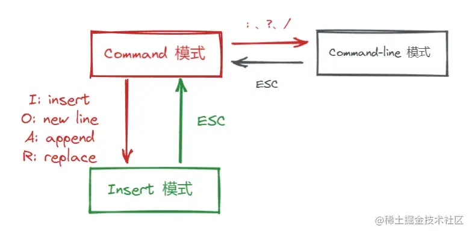

# Linux

### 介绍

Linux，Linux Is Not UniX 的[递归缩写](https://baike.baidu.com/item/递归缩写/2216444?fromModule=lemma_inlink)，一般指GNU/Linux，是一套免费使用和自由传播的类Unix操作系统，是一个遵循POSIX的多用户、多任务、支持多线程和多[CPU](https://baike.baidu.com/item/CPU/120556?fromModule=lemma_inlink)的操作系统。

Linux继承了Unix以网络为核心的设计思想，是一个性能稳定的多用户网络操作系统。Linux有上百种不同的发行版，如基于社区开发的[Debian](https://baike.baidu.com/item/Debian/748667?fromModule=lemma_inlink)、[Arch Linux](https://baike.baidu.com/item/arch/1614148?fromtitle=arch%20linux&fromid=8876099)，和基于商业开发的[Red Hat Enterprise Linux](https://baike.baidu.com/item/Red%20Hat%20Enterprise%20Linux/10770503?fromModule=lemma_inlink)、[SUSE](https://baike.baidu.com/item/SUSE/60409?fromModule=lemma_inlink)、[Oracle Linux](https://baike.baidu.com/item/Oracle%20Linux/6876458?fromModule=lemma_inlink)等。

### Linux 系统镜像

| 系统        | 优点                                  | 缺点                         | 适用场景                   |
| ----------- | ------------------------------------- | ---------------------------- | -------------------------- |
| CentOS      | 稳定性高，企业及支持（原Red Hat衍生） | CentOS 8 已停止维护          | 传统企业服务器，生产环境   |
| Ubuntu      | 社区活跃，软件包丰富，LTS 本本稳定    | 默认软件较新，可能需手动降级 | 开发者、云原生、新手友好   |
| Debian      | 极稳定，软件包经过严格测试            | 软件版本较旧                 | 长期运行的服务、嵌入式系统 |
| Alma Linux  | CentOS 替代品，由社区支持             | 生态仍在发展中               | 替代 CentOS 的企业环境     |
| Rocky Linux | 类似 AlmaLinux，强调与 RHEL 兼容      | 同上                         | 同上                       |
| OpenSUSE    | 强大的 YaST 配置工具，适合复杂环境    | 国内资料较少                 | 企业混合环境、高级用户     |


### Linux 目录

| 目录   | 说明                                                         | 示例                      |
| ------ | ------------------------------------------------------------ | ------------------------- |
| /      | 系统根目录，所有目录的起点                                   |                           |
| /bin   | Binaries（二进制文件），存放经常使用的命令                   |                           |
| /etc   | 配置文件存放位置位置                                         | Nginx配置：/etx/nginx/    |
| /var   | 可变数据（日志、数据库、网站文件等）                         | 网站日志：/var/log/nginx/ |
| /home  | 普通用户的家目录，主目录                                     | 用户文件：/hoem/username/ |
| /tmp   | 临时文件（重启后清空）                                       | 缓存文件                  |
| /usr   | 用户程序与只读文件                                           | 软件安装：/usr/bin/       |
| /opt   | 第三方软件安装目录                                           | 自定义安装的 Java/Tomcat  |
| /root  | 管理员（root）的家目录                                       | 避免在此存放网站文件      |
| /dev   | 是 Device缩写，存放Linux的外部设备                           |                           |
| /lib   | Library（库）类似Windows的DLL文件，程序共享库                |                           |
| /meida | 系统识别设备 U盘、光驱等                                     |                           |
| /sys   | Linux2.6内核                                                 |                           |
| /proc  | Process 进程目录，伪文件系统                                 |                           |
| /mnt   | 让用户临时挂在别的文件系统目录                               |                           |
| /srv   | 服务启动之后需要提取的数据                                   |                           |
| /run   | 临时文件系统，存储系统启动以来的信息，当系统启动时该目录下的文件应该会被清除 |                           |


### Linux 命令

#### 文件与目录操作

| 命令     | 描述             | 示例                                                         |
| -------- | ---------------- | ------------------------------------------------------------ |
| cd       | 切换目录         | cd /var                                                      |
| ls       | 列出所有文件目录 | ls -l                                                        |
| mkdir    | 新建文件夹       | mkdir www                                                    |
| touch    | 新建文件         | touch index.html                                             |
| rm       | 删除文件         | rm -f /www  （强制删除/www目录）                             |
| mv       | 移动文件/重命名  | mv old.txt new.txt （文件重命名） <br /> mv file.tx /var （移动文件） |
| cp       | 复制文件/目录    | cp file.txt /var <br /> cp -r dir1 dir2 （复制目录包括目录下所有文件） |
| rz       | 上传文件         |                                                              |
| ifconfig | 查看网卡信息     |                                                              |
| pwd      | 显示当前工作目录 |                                                              |
| tar      | 打包/解压文件    | tar -czvf archive.tar.gz dir/ (压缩) <br /> tar -xzvf archive.tar.gz (解压) |
| cat      | 查看文件内容     | cat file.txt <br /> cat file1.txt file2.txt > newfile.txt (合并文件) |
| nano     | 简单文本编辑器   | nano file.txt                                                |
| chmod    | 修改文件权限     | chmod 755 file.sh (赋予可执行权限)                           |
| chown    | 修改文件所有者   |                                                              |
|          |                  |                                                              |
|          |                  |                                                              |

常用命令示例

```sh
# 检查端口是否被占用
sudo netstat -tuln | grep [端口号]
# 或者
sudo ss -tuln | grep [端口号]
```
####  Linux 命令速查表，菜鸟教程

|                                                              |                                                              |                                                              |                                                              |
| :----------------------------------------------------------- | ------------------------------------------------------------ | ------------------------------------------------------------ | ------------------------------------------------------------ |
| **1、文件管理**                                              |                                                              |                                                              |                                                              |
| [cat](https://www.runoob.com/linux/linux-comm-cat.html)      | [chattr](https://www.runoob.com/linux/linux-comm-chattr.html) | [chgrp](https://www.runoob.com/linux/linux-comm-chgrp.html)  | [chmod](https://www.runoob.com/linux/linux-comm-chmod.html)  |
| [chown](https://www.runoob.com/linux/linux-comm-chown.html)  | [cksum](https://www.runoob.com/linux/linux-comm-cksum.html)  | [cmp](https://www.runoob.com/linux/linux-comm-cmp.html)      | [diff](https://www.runoob.com/linux/linux-comm-diff.html)    |
| [diffstat](https://www.runoob.com/linux/linux-comm-diffstat.html) | [file](https://www.runoob.com/linux/linux-comm-file.html)    | [find](https://www.runoob.com/linux/linux-comm-find.html)    | [git](https://www.runoob.com/linux/linux-comm-git.html)      |
| [gitview](https://www.runoob.com/linux/linux-comm-gitview.html) | [indent](https://www.runoob.com/linux/linux-comm-indent.html) | [cut](https://www.runoob.com/linux/linux-comm-cut.html)      | [ln](https://www.runoob.com/linux/linux-comm-ln.html)        |
| [less](https://www.runoob.com/linux/linux-comm-less.html)    | [locate](https://www.runoob.com/linux/linux-comm-locate.html) | [lsattr](https://www.runoob.com/linux/linux-comm-lsattr.html) | [mattrib](https://www.runoob.com/linux/linux-comm-mattrib.html) |
| [mc](https://www.runoob.com/linux/linux-comm-mc.html)        | [mdel](https://www.runoob.com/linux/linux-comm-mdel.html)    | [mdir](https://www.runoob.com/linux/linux-comm-mdir.html)    | [mktemp](https://www.runoob.com/linux/linux-comm-mktemp.html) |
| [more](https://www.runoob.com/linux/linux-comm-more.html)    | [mmove](https://www.runoob.com/linux/linux-comm-mmove.html)  | [mread](https://www.runoob.com/linux/linux-comm-mread.html)  | [mren](https://www.runoob.com/linux/linux-comm-mren.html)    |
| [mtools](https://www.runoob.com/linux/linux-comm-mtools.html) | [mtoolstest](https://www.runoob.com/linux/linux-comm-mtoolstest.html) | [mv](https://www.runoob.com/linux/linux-comm-mv.html)        | [od](https://www.runoob.com/linux/linux-comm-od.html)        |
| [paste](https://www.runoob.com/linux/linux-comm-paste.html)  | [patch](https://www.runoob.com/linux/linux-comm-patch.html)  | [rcp](https://www.runoob.com/linux/linux-comm-rcp.html)      | [rm](https://www.runoob.com/linux/linux-comm-rm.html)        |
| [slocate](https://www.runoob.com/linux/linux-comm-slocate.html) | [split](https://www.runoob.com/linux/linux-comm-split.html)  | [tee](https://www.runoob.com/linux/linux-comm-tee.html)      | [tmpwatch](https://www.runoob.com/linux/linux-comm-tmpwatch.html) |
| [touch](https://www.runoob.com/linux/linux-comm-touch.html)  | [umask](https://www.runoob.com/linux/linux-comm-umask.html)  | [which](https://www.runoob.com/linux/linux-comm-which.html)  | [cp](https://www.runoob.com/linux/linux-comm-cp.html)        |
| [whereis](https://www.runoob.com/linux/linux-comm-whereis.html) | [mcopy](https://www.runoob.com/linux/linux-comm-mcopy.html)  | [mshowfat](https://www.runoob.com/linux/linux-comm-mshowfat.html) | [rhmask](https://www.runoob.com/linux/linux-comm-rhmask.html) |
| [scp](https://www.runoob.com/linux/linux-comm-scp.html)      | [awk](https://www.runoob.com/linux/linux-comm-awk.html)      | [read](https://www.runoob.com/linux/linux-comm-read.html)    | [updatedb](https://www.runoob.com/linux/linux-comm-updatedb.html) |
|                                                              |                                                              |                                                              |                                                              |
| **2、文档编辑**                                              |                                                              |                                                              |                                                              |
| [col](https://www.runoob.com/linux/linux-comm-col.html)      | [colrm](https://www.runoob.com/linux/linux-comm-colrm.html)  | [comm](https://www.runoob.com/linux/linux-comm-comm.html)    | [csplit](https://www.runoob.com/linux/linux-comm-csplit.html) |
| [ed](https://www.runoob.com/linux/linux-comm-ed.html)        | [egrep](https://www.runoob.com/linux/linux-comm-egrep.html)  | [ex](https://www.runoob.com/linux/linux-comm-ex.html)        | [fgrep](https://www.runoob.com/linux/linux-comm-fgrep.html)  |
| [fmt](https://www.runoob.com/linux/linux-comm-fmt.html)      | [fold](https://www.runoob.com/linux/linux-comm-fold.html)    | [grep](https://www.runoob.com/linux/linux-comm-grep.html)    | [ispell](https://www.runoob.com/linux/linux-comm-ispell.html) |
| [jed](https://www.runoob.com/linux/linux-comm-jed.html)      | [joe](https://www.runoob.com/linux/linux-comm-joe.html)      | [join](https://www.runoob.com/linux/linux-comm-join.html)    | [look](https://www.runoob.com/linux/linux-comm-look.html)    |
| [mtype](https://www.runoob.com/linux/linux-comm-mtype.html)  | [pico](https://www.runoob.com/linux/linux-comm-pico.html)    | [rgrep](https://www.runoob.com/linux/linux-comm-rgrep.html)  | [sed](https://www.runoob.com/linux/linux-comm-sed.html)      |
| [sort](https://www.runoob.com/linux/linux-comm-sort.html)    | [spell](https://www.runoob.com/linux/linux-comm-spell.html)  | [tr](https://www.runoob.com/linux/linux-comm-tr.html)        | [expr](https://www.runoob.com/linux/linux-comm-expr.html)    |
| [uniq](https://www.runoob.com/linux/linux-comm-uniq.html)    | [wc](https://www.runoob.com/linux/linux-comm-wc.html)        | [let](https://www.runoob.com/linux/linux-comm-let.html)      |                                                              |
|                                                              |                                                              |                                                              |                                                              |
| **3、文件传输**                                              |                                                              |                                                              |                                                              |
| [lprm](https://www.runoob.com/linux/linux-comm-lprm.html)    | [lpr](https://www.runoob.com/linux/linux-comm-lpr.html)      | [lpq](https://www.runoob.com/linux/linux-comm-lpq.html)      | [lpd](https://www.runoob.com/linux/linux-comm-lpd.html)      |
| [bye](https://www.runoob.com/linux/linux-comm-bye.html)      | [ftp](https://www.runoob.com/linux/linux-comm-ftp.html)      | [uuto](https://www.runoob.com/linux/linux-comm-uuto.html)    | [uupick](https://www.runoob.com/linux/linux-comm-uupick.html) |
| [uucp](https://www.runoob.com/linux/linux-comm-uucp.html)    | [uucico](https://www.runoob.com/linux/linux-comm-uucico.html) | [tftp](https://www.runoob.com/linux/linux-comm-tftp.html)    | [ncftp](https://www.runoob.com/linux/linux-comm-ncftp.html)  |
| [ftpshut](https://www.runoob.com/linux/linux-comm-ftpshut.html) | [ftpwho](https://www.runoob.com/linux/linux-comm-ftpwho.html) | [ftpcount](https://www.runoob.com/linux/linux-comm-ftpcount.html) |                                                              |
|                                                              |                                                              |                                                              |                                                              |
| **4、磁盘管理**                                              |                                                              |                                                              |                                                              |
| [cd](https://www.runoob.com/linux/linux-comm-cd.html)        | [df](https://www.runoob.com/linux/linux-comm-df.html)        | [dirs](https://www.runoob.com/linux/linux-comm-dirs.html)    | [du](https://www.runoob.com/linux/linux-comm-du.html)        |
| [edquota](https://www.runoob.com/linux/linux-comm-edquota.html) | [eject](https://www.runoob.com/linux/linux-comm-eject.html)  | [mcd](https://www.runoob.com/linux/linux-comm-mcd.html)      | [mdeltree](https://www.runoob.com/linux/linux-comm-mdeltree.html) |
| [mdu](https://www.runoob.com/linux/linux-comm-mdu.html)      | [mkdir](https://www.runoob.com/linux/linux-comm-mkdir.html)  | [mlabel](https://www.runoob.com/linux/linux-comm-mlabel.html) | [mmd](https://www.runoob.com/linux/linux-comm-mmd.html)      |
| [mrd](https://www.runoob.com/linux/linux-comm-mrd.html)      | [mzip](https://www.runoob.com/linux/linux-comm-mzip.html)    | [pwd](https://www.runoob.com/linux/linux-comm-pwd.html)      | [quota](https://www.runoob.com/linux/linux-comm-quota.html)  |
| [mount](https://www.runoob.com/linux/linux-comm-mount.html)  | [mmount](https://www.runoob.com/linux/linux-comm-mmount.html) | [rmdir](https://www.runoob.com/linux/linux-comm-rmdir.html)  | [rmt](https://www.runoob.com/linux/linux-comm-rmt.html)      |
| [stat](https://www.runoob.com/linux/linux-comm-stat.html)    | [tree](https://www.runoob.com/linux/linux-comm-tree.html)    | [umount](https://www.runoob.com/linux/linux-comm-umount.html) | [ls](https://www.runoob.com/linux/linux-comm-ls.html)        |
| [quotacheck](https://www.runoob.com/linux/linux-comm-quotacheck.html) | [quotaoff](https://www.runoob.com/linux/linux-comm-quotaoff.html) | [lndir](https://www.runoob.com/linux/linux-comm-lndir.html)  | [repquota](https://www.runoob.com/linux/linux-comm-repquota.html) |
| [quotaon](https://www.runoob.com/linux/linux-comm-quotaon.html) |                                                              |                                                              |                                                              |
|                                                              |                                                              |                                                              |                                                              |
| **5、磁盘维护**                                              |                                                              |                                                              |                                                              |
| [badblocks](https://www.runoob.com/linux/linux-comm-badblocks.html) | [cfdisk](https://www.runoob.com/linux/linux-comm-cfdisk.html) | [dd](https://www.runoob.com/linux/linux-comm-dd.html)        | [e2fsck](https://www.runoob.com/linux/linux-comm-e2fsck.html) |
| [ext2ed](https://www.runoob.com/linux/linux-comm-ext2ed.html) | [fsck](https://www.runoob.com/linux/linux-comm-fsck.html)    | [fsck.minix](https://www.runoob.com/linux/linux-comm-fsck-minix.html) | [fsconf](https://www.runoob.com/linux/linux-comm-fsconf.html) |
| [fdformat](https://www.runoob.com/linux/linux-comm-fdformat.html) | [hdparm](https://www.runoob.com/linux/linux-comm-hdparm.html) | [mformat](https://www.runoob.com/linux/linux-comm-mformat.html) | [mkbootdisk](https://www.runoob.com/linux/linux-comm-mkbootdisk.html) |
| [mkdosfs](https://www.runoob.com/linux/linux-comm-mkdosfs.html) | [mke2fs](https://www.runoob.com/linux/linux-comm-mke2fs.html) | [mkfs.ext2](https://www.runoob.com/linux/linux-comm-mkfs-ext2.html) | [mkfs.msdos](https://www.runoob.com/linux/linux-comm-mkfs-msdos.html) |
| [mkinitrd](https://www.runoob.com/linux/linux-comm-mkinitrd.html) | [mkisofs](https://www.runoob.com/linux/linux-comm-mkisofs.html) | [mkswap](https://www.runoob.com/linux/linux-comm-mkswap.html) | [mpartition](https://www.runoob.com/linux/linux-comm-mpartition.html) |
| [swapon](https://www.runoob.com/linux/linux-comm-swapon.html) | [symlinks](https://www.runoob.com/linux/linux-comm-symlinks.html) | [sync](https://www.runoob.com/linux/linux-comm-sync.html)    | [mbadblocks](https://www.runoob.com/linux/linux-comm-mbadblocks.html) |
| [mkfs.minix](https://www.runoob.com/linux/linux-comm-mkfs-minix.html) | [fsck.ext2](https://www.runoob.com/linux/linux-comm-fsck-ext2.html) | [fdisk](https://www.runoob.com/linux/linux-comm-fdisk.html)  | [losetup](https://www.runoob.com/linux/linux-comm-losetup.html) |
| [mkfs](https://www.runoob.com/linux/linux-comm-mkfs.html)    | [sfdisk](https://www.runoob.com/linux/linux-comm-sfdisk.html) | [swapoff](https://www.runoob.com/linux/linux-comm-swapoff.html) |                                                              |
|                                                              |                                                              |                                                              |                                                              |
| **6、网络通讯**                                              |                                                              |                                                              |                                                              |
| [apachectl](https://www.runoob.com/linux/linux-comm-apachectl.html) | [arpwatch](https://www.runoob.com/linux/linux-comm-arpwatch.html) | [dip](https://www.runoob.com/linux/linux-comm-dip.html)      | [getty](https://www.runoob.com/linux/linux-comm-getty.html)  |
| [mingetty](https://www.runoob.com/linux/linux-comm-mingetty.html) | [uux](https://www.runoob.com/linux/linux-comm-uux.html)      | [telnet](https://www.runoob.com/linux/linux-comm-telnet.html) | [uulog](https://www.runoob.com/linux/linux-comm-uulog.html)  |
| [uustat](https://www.runoob.com/linux/linux-comm-uustat.html) | [ppp-off](https://www.runoob.com/linux/linux-comm-ppp-off.html) | [netconfig](https://www.runoob.com/linux/linux-comm-netconfig.html) | [nc](https://www.runoob.com/linux/linux-comm-nc.html)        |
| [httpd](https://www.runoob.com/linux/linux-comm-httpd.html)  | [ifconfig](https://www.runoob.com/linux/linux-comm-ifconfig.html) | [minicom](https://www.runoob.com/linux/linux-comm-minicom.html) | [mesg](https://www.runoob.com/linux/linux-comm-mesg.html)    |
| [dnsconf](https://www.runoob.com/linux/linux-comm-dnsconf.html) | [wall](https://www.runoob.com/linux/linux-comm-wall.html)    | [netstat](https://www.runoob.com/linux/linux-comm-netstat.html) | [ping](https://www.runoob.com/linux/linux-comm-ping.html)    |
| [pppstats](https://www.runoob.com/linux/linux-comm-pppstats.html) | [samba](https://www.runoob.com/linux/linux-comm-samba.html)  | [setserial](https://www.runoob.com/linux/linux-comm-setserial.html) | [talk](https://www.runoob.com/linux/linux-comm-talk.html)    |
| [traceroute](https://www.runoob.com/linux/linux-comm-traceroute.html) | [tty](https://www.runoob.com/linux/linux-comm-tty.html)      | [newaliases](https://www.runoob.com/linux/linux-comm-newaliases.html) | [uuname](https://www.runoob.com/linux/linux-comm-uuname.html) |
| [netconf](https://www.runoob.com/linux/linux-comm-netconf.html) | [write](https://www.runoob.com/linux/linux-comm-write.html)  | [statserial](https://www.runoob.com/linux/linux-comm-statserial.html) | [efax](https://www.runoob.com/linux/linux-comm-efax.html)    |
| [pppsetup](https://www.runoob.com/linux/linux-comm-pppsetup.html) | [tcpdump](https://www.runoob.com/linux/linux-comm-tcpdump.html) | [ytalk](https://www.runoob.com/linux/linux-comm-ytalk.html)  | [cu](https://www.runoob.com/linux/linux-comm-cu.html)        |
| [smbd](https://www.runoob.com/linux/linux-comm-smbd.html)    | [testparm](https://www.runoob.com/linux/linux-comm-testparm.html) | [smbclient](https://www.runoob.com/linux/linux-comm-smbclient.html) | [shapecfg](https://www.runoob.com/linux/linux-comm-shapecfg.html) |
|                                                              |                                                              |                                                              |                                                              |
| **7、系统管理**                                              |                                                              |                                                              |                                                              |
| [adduser](https://www.runoob.com/linux/linux-comm-adduser.html) | [chfn](https://www.runoob.com/linux/linux-comm-chfn.html)    | [useradd](https://www.runoob.com/linux/linux-comm-useradd.html) | [date](https://www.runoob.com/linux/linux-comm-date.html)    |
| [exit](https://www.runoob.com/linux/linux-comm-exit.html)    | [finger](https://www.runoob.com/linux/linux-comm-finger.html) | [fwhios](https://www.runoob.com/linux/linux-comm-fwhios.html) | [sleep](https://www.runoob.com/linux/linux-comm-sleep.html)  |
| [suspend](https://www.runoob.com/linux/linux-comm-suspend.html) | [groupdel](https://www.runoob.com/linux/linux-comm-groupdel.html) | [groupmod](https://www.runoob.com/linux/linux-comm-groupmod.html) | [halt](https://www.runoob.com/linux/linux-comm-halt.html)    |
| [kill](https://www.runoob.com/linux/linux-comm-kill.html)    | [last](https://www.runoob.com/linux/linux-comm-last.html)    | [lastb](https://www.runoob.com/linux/linux-comm-lastb.html)  | [login](https://www.runoob.com/linux/linux-comm-login.html)  |
| [logname](https://www.runoob.com/linux/linux-comm-logname.html) | [logout](https://www.runoob.com/linux/linux-comm-logout.html) | [ps](https://www.runoob.com/linux/linux-comm-ps.html)        | [nice](https://www.runoob.com/linux/linux-comm-nice.html)    |
| [procinfo](https://www.runoob.com/linux/linux-comm-procinfo.html) | [top](https://www.runoob.com/linux/linux-comm-top.html)      | [pstree](https://www.runoob.com/linux/linux-comm-pstree.html) | [reboot](https://www.runoob.com/linux/linux-comm-reboot.html) |
| [rlogin](https://www.runoob.com/linux/linux-comm-rlogin.html) | [rsh](https://www.runoob.com/linux/linux-comm-rsh.html)      | [sliplogin](https://www.runoob.com/linux/linux-comm-sliplogin.html) | [screen](https://www.runoob.com/linux/linux-comm-screen.html) |
| [shutdown](https://www.runoob.com/linux/linux-comm-shutdown.html) | [rwho](https://www.runoob.com/linux/linux-comm-rwho.html)    | [sudo](https://www.runoob.com/linux/linux-comm-sudo.html)    | [gitps](https://www.runoob.com/linux/linux-comm-gitps.html)  |
| [swatch](https://www.runoob.com/linux/linux-comm-swatch.html) | [tload](https://www.runoob.com/linux/linux-comm-tload.html)  | [logrotate](https://www.runoob.com/linux/linux-comm-logrotate.html) | [uname](https://www.runoob.com/linux/linux-comm-uname.html)  |
| [chsh](https://www.runoob.com/linux/linux-comm-chsh.html)    | [userconf](https://www.runoob.com/linux/linux-comm-userconf.html) | [userdel](https://www.runoob.com/linux/linux-comm-userdel.html) | [usermod](https://www.runoob.com/linux/linux-comm-usermod.html) |
| [vlock](https://www.runoob.com/linux/linux-comm-vlock.html)  | [who](https://www.runoob.com/linux/linux-comm-who.html)      | [whoami](https://www.runoob.com/linux/linux-comm-whoami.html) | [whois](https://www.runoob.com/linux/linux-comm-whois.html)  |
| [newgrp](https://www.runoob.com/linux/linux-comm-newgrp.html) | [renice](https://www.runoob.com/linux/linux-comm-renice.html) | [su](https://www.runoob.com/linux/linux-comm-su.html)        | [skill](https://www.runoob.com/linux/linux-comm-skill.html)  |
| [w](https://www.runoob.com/linux/linux-comm-w.html)          | [id](https://www.runoob.com/linux/linux-comm-id.html)        | [groupadd](https://www.runoob.com/linux/linux-comm-groupadd.html) | [free](https://www.runoob.com/linux/linux-comm-free.html)    |
|                                                              |                                                              |                                                              |                                                              |
| **8、系统设置**                                              |                                                              |                                                              |                                                              |
| [reset](https://www.runoob.com/linux/linux-comm-reset.html)  | [clear](https://www.runoob.com/linux/linux-comm-clear.html)  | [alias](https://www.runoob.com/linux/linux-comm-alias.html)  | [dircolors](https://www.runoob.com/linux/linux-comm-dircolors.html) |
| [aumix](https://www.runoob.com/linux/linux-comm-aumix.html)  | [bind](https://www.runoob.com/linux/linux-comm-bind.html)    | [chroot](https://www.runoob.com/linux/linux-comm-chroot.html) | [clock](https://www.runoob.com/linux/linux-comm-clock.html)  |
| [crontab](https://www.runoob.com/linux/linux-comm-crontab.html) | [declare](https://www.runoob.com/linux/linux-comm-declare.html) | [depmod](https://www.runoob.com/linux/linux-comm-depmod.html) | [dmesg](https://www.runoob.com/linux/linux-comm-dmesg.html)  |
| [enable](https://www.runoob.com/linux/linux-comm-enable.html) | [eval](https://www.runoob.com/linux/linux-comm-eval.html)    | [export](https://www.runoob.com/linux/linux-comm-export.html) | [pwunconv](https://www.runoob.com/linux/linux-comm-pwunconv.html) |
| [grpconv](https://www.runoob.com/linux/linux-comm-grpconv.html) | [rpm](https://www.runoob.com/linux/linux-comm-rpm.html)      | [insmod](https://www.runoob.com/linux/linux-comm-insmod.html) | [kbdconfig](https://www.runoob.com/linux/linux-comm-kbdconfig.html) |
| [lilo](https://www.runoob.com/linux/linux-comm-lilo.html)    | [liloconfig](https://www.runoob.com/linux/linux-comm-liloconfig.html) | [lsmod](https://www.runoob.com/linux/linux-comm-lsmod.html)  | [minfo](https://www.runoob.com/linux/linux-comm-minfo.html)  |
| [set](https://www.runoob.com/linux/linux-comm-set.html)      | [modprobe](https://www.runoob.com/linux/linux-comm-modprobe.html) | [ntsysv](https://www.runoob.com/linux/linux-comm-ntsysv.html) | [mouseconfig](https://www.runoob.com/linux/linux-comm-mouseconfig.html) |
| [passwd](https://www.runoob.com/linux/linux-comm-passwd.html) | [pwconv](https://www.runoob.com/linux/linux-comm-pwconv.html) | [rdate](https://www.runoob.com/linux/linux-comm-rdate.html)  | [resize](https://www.runoob.com/linux/linux-comm-resize.html) |
| [rmmod](https://www.runoob.com/linux/linux-comm-rmmod.html)  | [grpunconv](https://www.runoob.com/linux/linux-comm-grpunconv.html) | [modinfo](https://www.runoob.com/linux/linux-comm-modinfo.html) | [time](https://www.runoob.com/linux/linux-comm-time.html)    |
| [setup](https://www.runoob.com/linux/linux-comm-setup.html)  | [sndconfig](https://www.runoob.com/linux/linux-comm-sndconfig.html) | [setenv](https://www.runoob.com/linux/linux-comm-setenv.html) | [setconsole](https://www.runoob.com/linux/linux-comm-setconsole.html) |
| [timeconfig](https://www.runoob.com/linux/linux-comm-timeconfig.html) | [ulimit](https://www.runoob.com/linux/linux-comm-ulimit.html) | [unset](https://www.runoob.com/linux/linux-comm-unset.html)  | [chkconfig](https://www.runoob.com/linux/linux-comm-chkconfig.html) |
| [apmd](https://www.runoob.com/linux/linux-comm-apmd.html)    | [hwclock](https://www.runoob.com/linux/linux-comm-hwclock.html) | [mkkickstart](https://www.runoob.com/linux/linux-comm-mkkickstart.html) | [fbset](https://www.runoob.com/linux/linux-comm-fbset.html)  |
| [unalias](https://www.runoob.com/linux/linux-comm-unalias.html) | [SVGATextMode](https://www.runoob.com/linux/linux-comm-svgatextmode.html) | [gpasswd](https://www.runoob.com/linux/linux-comm-gpasswd.html) |                                                              |
|                                                              |                                                              |                                                              |                                                              |
| **9、备份压缩**                                              |                                                              |                                                              |                                                              |
| [ar](https://www.runoob.com/linux/linux-comm-ar.html)        | [bunzip2](https://www.runoob.com/linux/linux-comm-bunzip2.html) | [bzip2](https://www.runoob.com/linux/linux-comm-bzip2.html)  | [bzip2recover](https://www.runoob.com/linux/linux-comm-bzip2recover.html) |
| [gunzip](https://www.runoob.com/linux/linux-comm-gunzip.html) | [unarj](https://www.runoob.com/linux/linux-comm-unarj.html)  | [compress](https://www.runoob.com/linux/linux-comm-compress.html) | [cpio](https://www.runoob.com/linux/linux-comm-cpio.html)    |
| [dump](https://www.runoob.com/linux/linux-comm-dump.html)    | [uuencode](https://www.runoob.com/linux/linux-comm-uuencode.html) | [gzexe](https://www.runoob.com/linux/linux-comm-gzexe.html)  | [gzip](https://www.runoob.com/linux/linux-comm-gzip.html)    |
| [lha](https://www.runoob.com/linux/linux-comm-lha.html)      | [restore](https://www.runoob.com/linux/linux-comm-restore.html) | [tar](https://www.runoob.com/linux/linux-comm-tar.html)      | [uudecode](https://www.runoob.com/linux/linux-comm-uudecode.html) |
| [unzip](https://www.runoob.com/linux/linux-comm-unzip.html)  | [zip](https://www.runoob.com/linux/linux-comm-zip.html)      | [zipinfo](https://www.runoob.com/linux/linux-comm-zipinfo.html) |                                                              |
|                                                              |                                                              |                                                              |                                                              |
| **10、设备管理**                                             |                                                              |                                                              |                                                              |
| [setleds](https://www.runoob.com/linux/linux-comm-setleds.html) | [loadkeys](https://www.runoob.com/linux/linux-comm-loadkeys.html) | [rdev](https://www.runoob.com/linux/linux-comm-rdev.html)    | [dumpkeys](https://www.runoob.com/linux/linux-comm-dumpkeys.html) |
| [MAKEDEV](https://www.runoob.com/linux/linux-comm-makedev.html) | [poweroff](https://www.runoob.com/linux/linux-comm-poweroff.html) |                                                              |                                                              |

## 其他命令

- [Linux bc 命令](https://www.runoob.com/linux/linux-comm-bc.html)
- [Linux tail 命令](https://www.runoob.com/linux/linux-comm-tail.html)
- [Linux head 命令](https://www.runoob.com/linux/linux-comm-head.html)
- [Linux xargs 命令](https://www.runoob.com/linux/linux-comm-xargs.html)
- [Linux ip 命令](https://www.runoob.com/linux/linux-comm-ip.html)
- [Linux nohup 命令](https://www.runoob.com/linux/linux-comm-nohup.html)
- [Linux killall 命令](https://www.runoob.com/linux/linux-comm-killall.html)
- [Linux pkill 命令](https://www.runoob.com/linux/linux-comm-pkill.html)

### Linux vim/vi 编辑器：

vim 编辑器有三种模式：

- **命令模式（视图模式）：** 当在终端中执行 vim 时，或者使用 vim 命令打开一个文件时，进入该模式

- **插入模式（编辑模式）：** 在命令模式下按 **I**/**i**、**O**/**o**、**A**/**a**、**R**/**r**、任意一个进入该模式

- **命令行模式：** 在命令模式下按 **:**、**？**、**/** 任意一个进入该模式



```shell
#命令模式下命令
i        #进入插入模式

#插入模式命令
esc      #退出插入模式

#命令行模式下命令
:q      #退出 vim
:q!     #强制退出 vim 不会保存文件
:w      #只保存
:wq     #保存退出
:w!     #强制保存，不推出vim
:wq!    #强制保存文件，并退出vim
:q!     #不保存文件，强制退出vim
:e!     #放弃所有修改，从上次保存文件开始再编辑命令历史

```


### 扩展文章

- [Linux 常用命令全拼](https://www.runoob.com/w3cnote/linux-command-full-fight.html)

  

