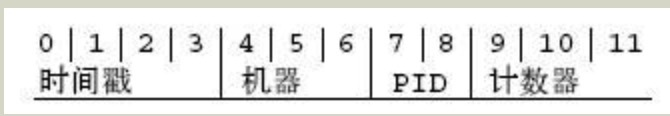

# MongoDB笔记

### MongoDB 简介

MongoDB 是一个基于分布式文件存储的数据库。由 C++ 语言编写。皆在为 web 应用提供可扩展的高性能数据存储解决方案。在高负载的情况下，添加更多的节点，可以保证服务器性能。

MongoDB 是一个介于关系数据库和非关系数据库之间的产品，是非关系型数据库数据库中功能最丰富的，最像关系型数据库的。

MongoDB 将数据存储为一个文档，数据结构由键值（key => value）对组成。MongoDB 文档类似于 JSON 对象。字段值可以包含其他文档，数据以及文档数据。


**主要特点：**

- DocumentOriented 文档导向：MongoDB 的数据格式是 JSON 风格的文档（Document）比传统的行列方式更为灵活，可以包含复杂的嵌套对象和数组。
- 高性能：MongoDB 提供了高性能的数据持久化方式，内存计算、索引等使其有非常高的读写性能。
- 高可用性：支持副本集实现高可用，当某节点故障时，可自动故障转移。
- 分片：支持无限水平拓展，可以通过集群和分片支持海量数据和高并发。
- 丰富的查询语言：支持丰富的查询表达式，查询语言同样是 JSON 风格的，可快速查询文档中的内嵌数据。
- 高度灵活的数据模型：非规范的文档模型使 MongoDB 可在不同应用场景中应用更加灵活。
- 索引支持：对任何属性进行索引支持查询优化和排序。

### NoSQL 简介

NoSQL (NoSQL = Not Only SQL)，意即“不仅仅是SQL”。

NoSQL 不使用 SQL 作为查询语言、不强制要求特定的表结构、易扩展、高性能、数据库类型多样种类繁多

在现代计算机系统上每天网络上都会产生庞大的数据。这些数据有很大一部分是由关系型数据库管理系统（RDBMS）来处理的。1970年 E.F.Codd's 提出的关系模型论文“A relational model of data for large shared data banks”，这是的数据建模和应用程序编程更加简单。

通过应用实践证明，关系模型是非常适合客户端服务器编程，远远超出预期的利益，今天它是结构化数据存储在网络和商务应用的主导技术。

NoSQL 是一项全新的数据库革命性运动，早期就有人提出，发展至 2009 年趋势越发高涨。NoSQL 的拥护者们提倡运用非关系型的数据存储，相对于普天盖的的关系型数据库运用，这一概念无疑是一种全新的思维注入。


### MongoDB 概念解析

| SQL术语/概念 | MongoDB术语/概念 | 解释/说明                           |
| :----------- | :--------------- | :---------------------------------- |
| database     | database         | 数据库                              |
| table        | collection       | 数据库表/集合                       |
| row          | document         | 数据记录行/文档                     |
| column       | field            | 数据字段/域                         |
| index        | index            | 索引                                |
| table joins  |                  | 表连接,MongoDB不支持                |
| primary key  | primary key      | 主键,MongoDB自动将_id字段设置为主键 |


#### 数据库

一个 MongoDB 中可以建立多个数据库。 MongoDB的默认数据库微 “db”，该数据库存储在 data 目录中。

MongoDB 的单个实例可以容纳多个独立的数据库，每一个都有自己的集合和权限，不同的数据库也放置在不同的文件中。

有一些数据库名是保留的，可以直接访问这些有特殊作用的数据库。

- **admin：**从权限角度来看，这是 “root” 数据库。要是将一个用户添加到这个数据库，这个用户自动继承所有数据库权限。一些特定的服务器端命令也只能从这个数据库运行，比如列出所有的数据库或者关闭服务器。
- **local：**这个数据永远不会被复制，可以用来存储限于本地单台服务器的任意组合
- **config：**当 Mongo 用于分片设置时，config 数据库在内部使用，用于保存分片相关信息。


### MongoDB 数据类型

常用的几种数据类型。

| 数据类型           | 描述                                                         |
| :----------------- | :----------------------------------------------------------- |
| String             | 字符串。存储数据常用的数据类型。在 MongoDB 中，UTF-8 编码的字符串才是合法的。 |
| Integer            | 整型数值。用于存储数值。根据你所采用的服务器，可分为 32 位或 64 位。 |
| Boolean            | 布尔值。用于存储布尔值（真/假）。                            |
| Double             | 双精度浮点值。用于存储浮点值。                               |
| Min/Max keys       | 将一个值与 BSON（二进制的 JSON）元素的最低值和最高值相对比。 |
| Array              | 用于将数组或列表或多个值存储为一个键。                       |
| Timestamp          | 时间戳。记录文档修改或添加的具体时间。                       |
| Object             | 用于内嵌文档。                                               |
| Null               | 用于创建空值。                                               |
| Symbol             | 符号。该数据类型基本上等同于字符串类型，但不同的是，它一般用于采用特殊符号类型的语言。 |
| Date               | 日期时间。用 UNIX 时间格式来存储当前日期或时间。你可以指定自己的日期时间：创建 Date 对象，传入年月日信息。 |
| Object ID          | 对象 ID。用于创建文档的 ID。                                 |
| Binary Data        | 二进制数据。用于存储二进制数据。                             |
| Code               | 代码类型。用于在文档中存储 JavaScript 代码。                 |
| Regular expression | 正则表达式类型。用于存储正则表达式。                         |

#### ObjectId

ObjectId 类似唯一的主键，可以很快地去生成和排序，包含 12bytes，含义是：

- 前 4 个字节表示创建 unix 时间戳，格林尼治时间 UTC 时间，比北京时间晚 8 个小时

- 接下来的 3 个字节是机器标识码

- 紧接的两个字节由 id 组成的 pid

- 最后三个字节是随机数

  

  

  

MongoDB 中存储的文档必须有一个 _id 键。这个键值可以是任何类型，默认是 ObjectId 对象。由于 ObjectId 中保存了创建的时间戳，所以你不需要为你的文档保存时间戳字段，可以通过 getTimestamp 函数来获取文档的创建时间：

```js
var newObject = ObjectId()
newObject.getTimestamp()
// 输出: ISODate("2023-09-27:14:12Z")
```

### MongoDB 连接


